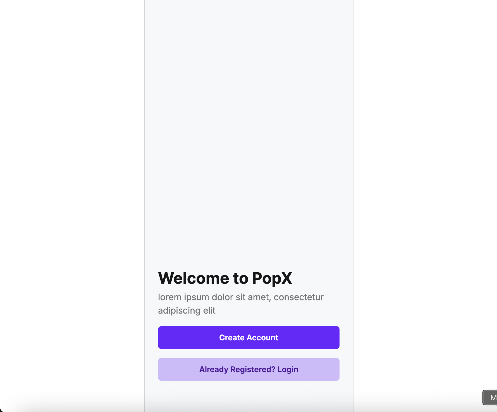
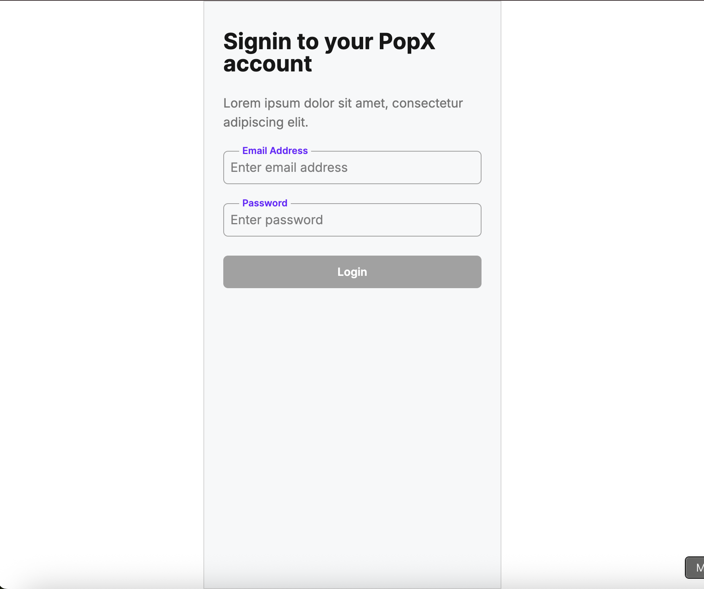
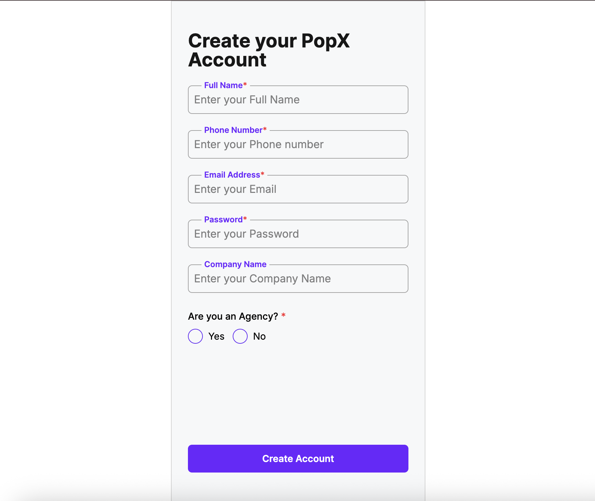
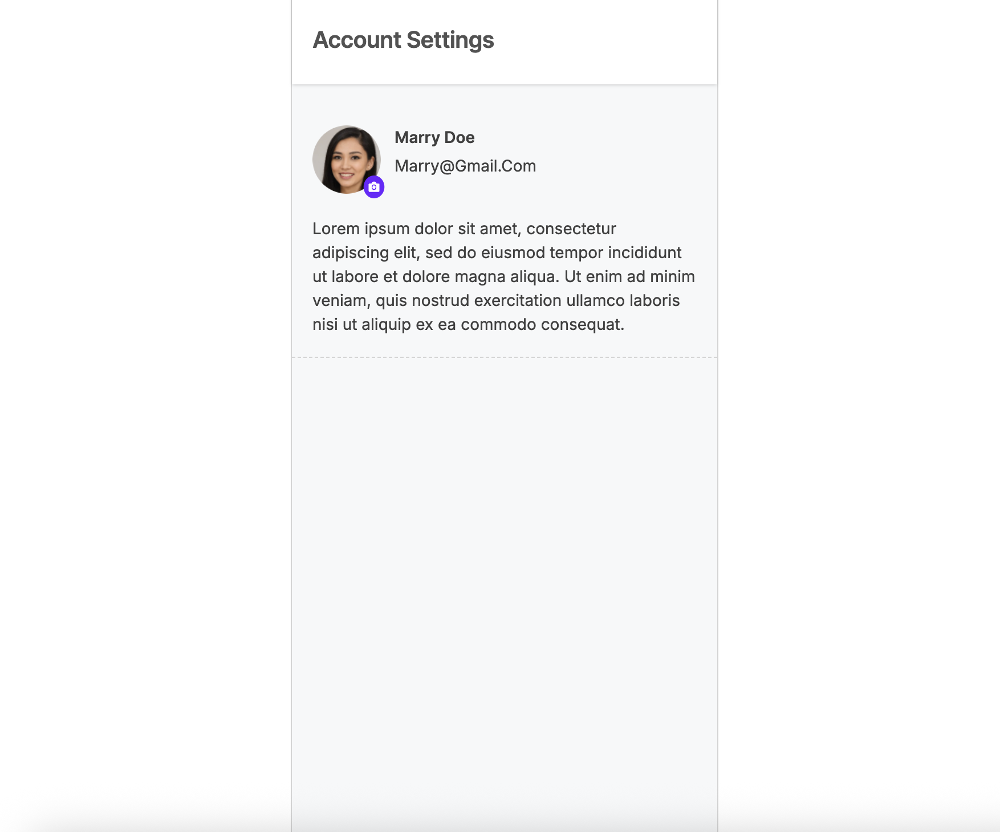

# PopX - Modern User Account Management Platform

Popx-App is a sleek, responsive web application built with React and TypeScript that provides a seamless user account management experience. The platform features an intuitive interface for user registration, authentication, and profile management.

## 🌟 Features

- **Streamlined User Experience**: Clean, modern UI with intuitive navigation
- **Responsive Design**: Fully optimized for both desktop and mobile devices
- **Secure Authentication**: Robust login and registration system
- **Profile Management**: Easily update personal information and profile pictures

## 📱 Application Screenshots

### Landing Screen



### Login Screen



### Signup Screen  



### Profile Screen



## 🚀 Technology Stack

- **Frontend**: React 18, TypeScript
- **Styling**: Tailwind CSS for responsive design
- **Routing**: React Router for seamless navigation
- **Build Tool**: Vite for lightning-fast development
- **Deployment**: Vercel for continuous deployment

## 🛠️ Installation & Setup

1. **Clone the repository**
   ```bash
   git clone https://github.com/sharmaHarshit2000/popx-app.git
   cd popx
   ```

2. **Install dependencies**
   ```bash
   npm install
   ```

3. **Start the development server**
   ```bash
   npm run dev
   ```

4. **Build for production**
   ```bash
   npm run build
   ```

## 🔍 Project Structure

```
src/
├── assets/        # Images and static resources
├── components/    # Reusable UI components
│   └── ui/        # Base UI elements (buttons, inputs, etc.)
├── pages/         # Main application pages
├── App.tsx        # Main application component
└── router.tsx     # Application routing configuration
```

## 🎨 UI Components

The application uses a component-based architecture with custom UI elements:

- **Button**: Custom button component with multiple variants
- **Input**: Form input fields with validation support
- **Card**: Profile display cards with customizable content
- **Radio**: Custom-styled radio buttons for form options
